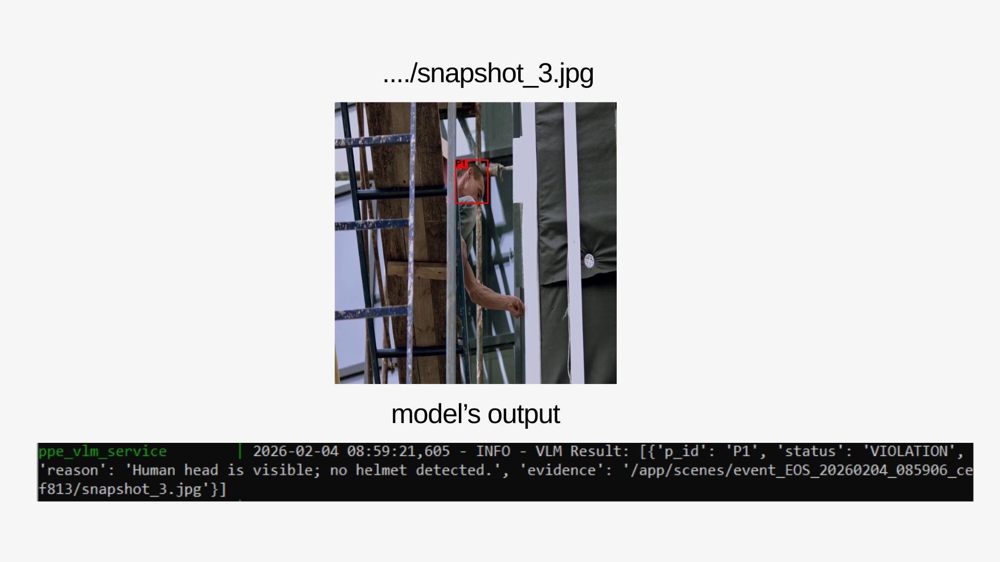

# Vision Risk Detection System


This project implements a multi-service asynchronous pipeline for automated PPE compliance and workplace safety monitoring. The system bridges traditional object detection with advanced visual reasoning to provide contextual risk analysis from live video streams.

## Core Architecture

The system operates through a decoupled Detection + VLM + Redis architecture. A specialized SmartStreamer handles frame ingestion using a sliding-window approach to identify potential risks via Roboflow-integrated inference. Once a detection occurs, the event is queued in Redis, allowing a separate VLM worker to perform asynchronous contextual analysis without bottlenecking the primary vision stream.

## Visual Reasoning with SmolVLM

Unlike standard detection models that only label objects, this system integrates [SmolVLM-500M-Instruct](https://huggingface.co/HuggingFaceTB/SmolVLM-500M-Instruct) to interpret the scene. This 500M-parameter model provides a high-performance balance between speed and intelligence, allowing the system to describe the specific nature of a risk—such as an individual's proximity to hazardous machinery—rather than simply reporting a missing safety item.

## Deployment and Scalability

The environment is fully containerized using a GPU-aware Docker Compose configuration, ensuring production-ready deployment with seamless access to hardware acceleration. The use of Redis as an event bus ensures that the inference engine and the VLM reasoning layer can scale independently based on workload requirements.

## Results


SmolVLM analyzing a construction site snapshot. The system identifies the individual (P1), detects the absence of mandatory safety gear, and generates a structured violation report stating: 'Human head is visible; no helmet detected.'

## Setup & Execution

### Prerequisites
* **Docker & Docker Compose**
* **NVIDIA Driver & NVIDIA Container Toolkit** (for GPU-accelerated inference)
* **Roboflow API Key** (Set in your environment variables)

### Installation & Running
1. **Clone the repository:**
   ```bash
   git clone https://github.com/metin-yat/vision-risk-detection.git
   cd vision-risk-detection
   ```

2. **Configure Environment:** Create a .env file in the root directory or ensure your docker-compose.yml has the necessary credentials:
   ```env
   ROBOFLOW_API_KEY=your_api_key_here
   ```

3. **Deploy with Docker Compose:** The entire pipeline (Redis, Streamer, and VLM Worker) can be started with a single command:
   ```bash
    docker-compose up --build
   ```

## Future Enhancements & Extensibility

The system is designed with modularity in mind, allowing for easy upgrades and research:

* **High-Parameter VLM Integration:** Transition from SmolVLM to more powerful models. To use a local model or a different service, simply update the **Model Loading** section of the code.
* **Transition to Segmentation:** While the current version utilizes Bounding Boxes (BBox), you can easily implement an Instance Segmentation model (e.g., SAM or YOLO-Seg). The architecture is ready for this transition; you only need to modify the **IoU (Intersection over Union)** and **SoM (Set-of-Mark)** logic to handle mask data.
* **Domain-Specific Fine-Tuning:** Fine-tune the VLM on specialized construction datasets to improve recognition of complex safety gear like harnesses or specific welding masks.
